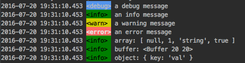
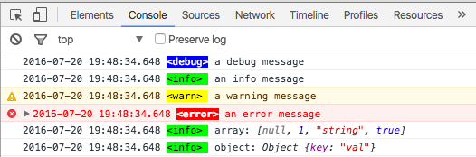

# yalm

[](https://badge.fury.io/js/yalm) 
[](https://gemnasium.com/github.com/hobbyquaker/yalm)
[](https://travis-ci.org/hobbyquaker/yalm)
[](https://github.com/sindresorhus/xo)
[![License][mit-badge]][mit-url]

A simple javascript logging module for Node.js and the Browser.

Offers 4 logging levels, adds timestamp, severity and colors (even in browser console if possible). 
Logs via console.log, console.warn (if available) and console.error.

## usage

```Javascript
log.debug('a debug message');
log.info('an info message');
log.warn('a warning message');
log.error('an error message');

log.info('array:', [null, 1, 'string', true]);
log.info('buffer:', new Buffer([32, 32]));
log('object:', {"key": "val"});
```

## output of above usage example

#### Node.js


#### Browser



## options

You can set desired loglevel...
```Javascript
log.setLevel('debug'); // default: 'info'. possible values: 4, 'debug', 3, 'info', 2, 'warn', 1, 'error', 0, 'silent'
```

... and you can disable printing of timestamps, severity and colors
```Javascript
log.setTimestamp(false);
log.setSeverity(false);
log.setColor(false);
```

## aliases

made for humans...
```Javascript
log('...'); // is an alias of log.info('...');
log.warning('...'); // is an alias of log.warn('...');
log.err('...'); // is an alias of log.error('...');
```

## change styling

if you want another timestamp format overwrite the log.ts function...
```Javascript
log.ts = function () {
    // seconds since epoch
    return '' + Math.floor((new Date()).getTime() / 1000);
};
```

... if you want to change the severity strings overwrite log.map properties
```Javascript
log.map.debug = 'DEBUG:';
log.map.info = 'INFO:';
log.map.warn = 'WARNING:';
log.map.error = 'ERROR:';
```

## custom log targets

if you want to log in a file or smth you can just overwrite the methods log.stdout, log.stdwrn and log.stderr with your own logging function.
```Javascript
log.stderr = log.stdwrn = log.stdout = function () {
    fs.appendFile('log.txt', Array.prototype.slice.call(arguments).join(' '));
};
```


## license

MIT © [Sebastian Raff](https://github.com/hobbyquaker)


[mit-badge]: https://img.shields.io/badge/License-MIT-blue.svg?style=flat
[mit-url]: LICENSE